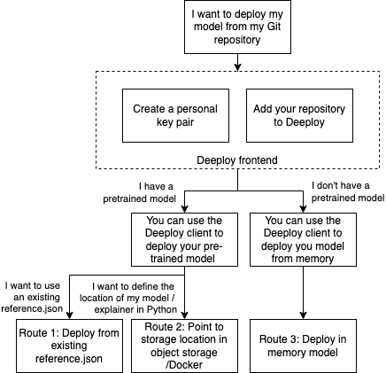

# Deploy and update
## Deploy flows
There are multiple routes that can be followed in order to create or update a new deployment. Below a schematic overview is shown of the available scenarios from the Deeploy client.



### Preparation
In order to deploy models, you need Personal Access Keys. For more information regarding authentication, see [Authentication](./auth.md).

Another part of the preparation is gettin familiar with the repository contract that Deeploy uses, you can find more information about that [here](https://deeploy-ml.zendesk.com/hc/en-150/articles/4411887195666-Preparing-a-repository).

### Route 1: Deploy from existing reference.json
Creating a deployment or updating from existing reference.json files requires passing a model and/or explainer type unless it is a custom Docker image.

**Create deployment**
* See [here](./api-reference/#deeploy.models.deploy_options) for all update arguments.
* See [here](./api-reference/#deploy) for all update arguments.
```
from deeploy import DeployOptions
from deeploy.enums import ModelType

deploy_options = DeployOptions(**{
        'name': 'My Deployment Name',
        'description': 'My Deployment Description'
    })

# create new deployment
client.deploy(
    options=deploy_options,
    overwrite=False,
    model_type=ModelType.PYTORCH.value,
    local_repository_path='myPath')
```
**Update**
* See [here](./api-reference.md/#deeploy.models.update_options) for all update arguments.
* See [here](./api-reference.md/#update) for all update arguments.
```
from deeploy import UpdateOptions
from deeploy.enums import ModelType

update_options = UpdateOptions(**{
        'name': 'My Deployment Name',
        'description': 'My Deployment Description'
    })

# create new deployment
client.update(
    options=update_options,
    overwrite=False,
    model_type=ModelType.PYTORCH.value,
    local_repository_path='myPath')
```

### Route 2: Point to a storage lation in object storage or Docker registry and let Deeploy generate a reference.json for you.
This approach will update the reference.json files in the repository or create new reference.json files if they do not yet exist.

**Create deployment**
* See [here](./api-reference.md/#deeploy.models.model_reference_json) for all blob reference arguments.
```
from deeploy import DeployOptions, BlobReference
from deeploy.enums import ModelType

# Create Blob reference
model_reference = BlobReference(**{
    'url': 's3://deeploy-examples/pytorch/agenet/model'
})

deploy_options = DeployOptions(**{
        'name': 'My Deployment Name',
        'description': 'My Deployment Description'
        'modelBlobConfig': model_reference,
    })

client.deploy(
    options=deploy_options,
    overwrite=True,
    model_type=ModelType.PYTORCH.value,
    local_repository_path='myPath',
    )
```
**Update**
```
from deeploy import UpdateOptions, BlobReference
from deeploy.enums import ModelType

# Create Blob reference
model_reference = BlobReference(**{
    'url': 's3://deeploy-examples/pytorch/agenet/model'
})

deploy_options = DeployOptions(**{
        'name': 'My Deployment Name',
        'description': 'My Deployment Description'
        'modelBlobConfig': model_reference,
    })

client.deploy(
    options=deploy_options,
    overwrite=True,
    model_type=ModelType.PYTORCH.value,
    local_repository_path='myPath',
    )
```

### Route 3: Deploy in memory model
When passing a model and/or explainer to the deploy function the client will update the reference.json files in the repository or create new reference.json files if they do not yet exist.

```
from deeploy import DeployOptions
from deeploy.enums import ModelType

deploy_options = DeployOptions(**{
        'name': 'My Deployment Name',
        'description': 'My Deployment Description'
    })

client.deploy(
    options=deploy_options,
    overwrite=True,
    model_type=ModelType.PYTORCH.value,
    local_repository_path='myPath',
    model=myPytorchModel)
```
